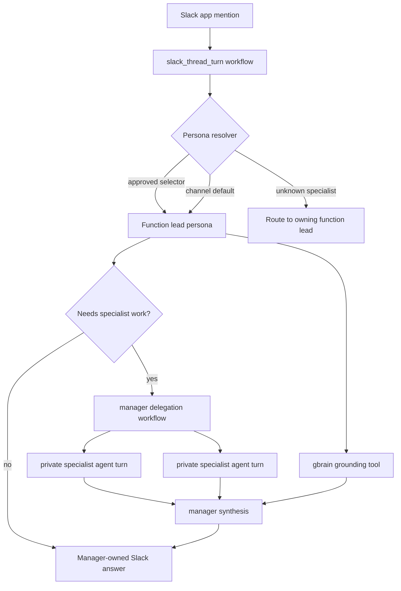

# feat: Build Raava Internal Centaur

## Summary

Build Raava Internal Centaur as an overlay-backed Slack product for internal Raava usage. The v1 Slack surface exposes eight function-lead personas, routes Slack turns to those leads through selectors or channel defaults, lets leads delegate private specialist work through workflows, and requires gbrain grounding for org and roster claims.

**Target repo:** `centaur`

---

## Problem Frame

The Raava roster already has enough decomposed specialist roles that exposing all of them in Slack would make the user choose the org chart before asking the question. The product should behave like an executive staff layer: a teammate asks Centaur in Slack, the right function lead owns the response, and any specialist work happens behind that lead as private execution capacity.

Centaur already supports the key primitives: Slack thread workflows, persona discovery through `type = "persona"` packages, overlay-mounted tools and workflows, prompt overlays, and child agent turns through the workflow engine. The implementation should package Raava behavior as an overlay and avoid turning the base platform into a Raava-specific fork.

---

## Requirements

**Persona Surface**

- R1. The Raava overlay exposes Chief, Vera, Priya, Enoch, Elena, Heathcliffe, Vivian, and Argus as the only top-level Slack personas by default.
- R2. Each top-level persona defines domain ownership, allowed channels, output shape, escalation rules, and specialist delegation rules.
- R3. Hana and Isaac are available only as manager-spawnable specialist managers in v1.
- R4. Retired, demoted, advisory, pod-engineer, and QA-specialist roles are not discoverable as first-class Slack personas.

**Slack Routing**

- R5. Slack turns resolve an approved function lead from an explicit persona selector, explicit workflow input, or channel default.
- R6. Channel defaults route common Raava Slack channels to a function lead without requiring users to memorize persona flags.
- R7. Explicit approved persona selection overrides channel defaults.
- R8. Slack replies identify the accountable function lead and summarize specialist involvement without exposing raw subagent chatter.

**Delegation And Grounding**

- R9. Function leads can spawn private specialist agent turns for bounded subtasks.
- R10. Specialist agent turns receive narrow briefs and return evidence to the manager workflow.
- R11. Manager workflows synthesize specialist results into one conclusion, evidence summary, risk list, and next-action set.
- R12. Specialist runs are durable and inspectable through workflow state rather than primary Slack UX.
- R13. Function leads must use gbrain before making claims about Raava roles, org structure, prior decisions, client context, or operating rules.
- R14. Argus preserves proposal-first behavior for fleet or runtime changes.
- R15. Vivian remains an independent quality gate persona and is not subordinated to engineering behavior or routing.
- R16. The current lean-roster decision remains the baseline unless gbrain or a human operator supplies a newer accepted org decision.

**Packaging And Verification**

- R17. Raava-specific personas, workflows, skills, prompts, and tool wrappers live in a Raava overlay directory.
- R18. Base Centaur remains reusable; Raava behavior is loaded through existing overlay and discovery mechanisms.
- R19. Loaded Raava personas are inspectable through Centaur's persona discovery endpoints.
- R20. Workflow-backed delegation is testable without Slack by invoking a workflow directly.

---

## High-Level Technical Design



The Raava overlay should be runnable from this repo for dogfood and local Docker verification, while still matching the external overlay shape documented by Centaur. The overlay supplies personas, tools, workflows, sandbox prompt guidance, and tests that point `TOOL_DIRS` and `WORKFLOW_DIRS` at the overlay during local verification.

---

## Key Technical Decisions

- **Overlay-first implementation:** Raava-specific behavior lands under a Raava overlay tree and is loaded through `TOOL_DIRS`, `WORKFLOW_DIRS`, and sandbox overlay conventions, preserving base-platform reuse.
- **Shadow the Slack workflow only for Raava routing:** Channel defaults and specialist redirection belong in a Raava `slack_thread_turn` workflow that composes the base behavior instead of changing global Slack semantics for every Centaur deployment.
- **Approved-lead registry as data plus tests:** The eight visible leads and private specialists should live in a small registry module so persona prompts, routing, and tests share one source of truth.
- **Manager delegation as workflow behavior:** Prompt instructions are not enough; delegation needs a workflow path that can start private agent turns, wait for results, and produce manager-owned synthesis.
- **gbrain as an overlay tool contract:** The overlay exposes a gbrain tool wrapper that can be mocked in tests and backed by hosted gbrain credentials in deployment.
- **Slack output remains manager-owned:** Specialist results are recorded in workflow outputs and compressed into the final answer, not posted as independent Slack thread replies.

---

## Output Structure

```text
overlays/raava-internal/
├── Dockerfile
├── README.md
├── tools/
│   ├── personas/
│   └── raava_gbrain/
├── workflows/
│   ├── _raava_roles.py
│   ├── raava_delegate.py
│   └── slack_thread_turn.py
├── .agents/
│   └── skills/
│       └── raava-centaur/
└── services/
    └── sandbox/
        └── SYSTEM_PROMPT.md
```

The final layout may add small helper modules when implementation reveals a cleaner split, but it should preserve the same overlay responsibilities.

---

## Implementation Units

### U1. Raava overlay scaffold and role registry

- **Goal:** Create a local Raava overlay with a canonical v1 lead and specialist registry.
- **Requirements:** R1, R3, R4, R16, R17, R18.
- **Dependencies:** None.
- **Files:** `overlays/raava-internal/Dockerfile`, `overlays/raava-internal/README.md`, `overlays/raava-internal/workflows/_raava_roles.py`, `overlays/raava-internal/services/sandbox/SYSTEM_PROMPT.md`, `overlays/raava-internal/.agents/skills/raava-centaur/SKILL.md`, `services/api/tests/test_raava_internal_overlay.py`.
- **Approach:** Model approved function leads, private specialist managers, channel defaults, and demoted-role redirects as importable overlay data. Keep the registry free of Slack and workflow side effects so tests can validate the product boundary directly.
- **Patterns to follow:** Overlay layout from `docs/pages/extend/overlay.mdx`; ACME overlay shape from `docs/pages/extend/acme-example.mdx`.
- **Test scenarios:** Verify the registry exposes exactly the eight function leads; verify Hana and Isaac are private specialists only; verify known demoted or decomposed roles resolve to a function lead rather than a top-level persona; verify channel defaults only target approved leads.
- **Verification:** A unit test can import the overlay registry and prove the v1 roster boundary without starting Slack or Docker.

### U2. Function-lead persona packages

- **Goal:** Add inspectable persona packages for the eight Raava function leads.
- **Requirements:** R1, R2, R8, R13, R14, R15, R16, R19.
- **Dependencies:** U1.
- **Files:** `overlays/raava-internal/tools/personas/chief/pyproject.toml`, `overlays/raava-internal/tools/personas/chief/PROMPT.md`, `overlays/raava-internal/tools/personas/vera/pyproject.toml`, `overlays/raava-internal/tools/personas/vera/PROMPT.md`, `overlays/raava-internal/tools/personas/priya/pyproject.toml`, `overlays/raava-internal/tools/personas/priya/PROMPT.md`, `overlays/raava-internal/tools/personas/enoch/pyproject.toml`, `overlays/raava-internal/tools/personas/enoch/PROMPT.md`, `overlays/raava-internal/tools/personas/elena/pyproject.toml`, `overlays/raava-internal/tools/personas/elena/PROMPT.md`, `overlays/raava-internal/tools/personas/heathcliffe/pyproject.toml`, `overlays/raava-internal/tools/personas/heathcliffe/PROMPT.md`, `overlays/raava-internal/tools/personas/vivian/pyproject.toml`, `overlays/raava-internal/tools/personas/vivian/PROMPT.md`, `overlays/raava-internal/tools/personas/argus/pyproject.toml`, `overlays/raava-internal/tools/personas/argus/PROMPT.md`, `services/api/tests/test_raava_internal_overlay.py`.
- **Approach:** Use Centaur persona metadata with `type = "persona"` and prompt files. Prompts should be concise operating contracts that name domains, output shape, gbrain grounding obligations, delegation boundaries, and role-specific safety posture.
- **Patterns to follow:** Existing persona package in `tools/personas/eng`; persona discovery tests in `services/api/tests/test_tool_manager.py`.
- **Test scenarios:** Verify `ToolManager` discovers all eight personas from the overlay tools directory; verify no private specialists are discovered as personas; verify persona details include non-empty descriptions and prompt content; verify Argus prompt includes proposal-first behavior; verify Vivian prompt preserves independent quality gate behavior.
- **Verification:** Persona discovery endpoints can load the overlay personas when `TOOL_DIRS` includes the Raava overlay.

### U3. Raava Slack persona routing

- **Goal:** Route Raava Slack turns to approved function leads through explicit selectors, workflow input, channel defaults, and specialist redirects.
- **Requirements:** R5, R6, R7, R8, R16.
- **Dependencies:** U1, U2.
- **Files:** `overlays/raava-internal/workflows/slack_thread_turn.py`, `services/api/tests/test_raava_internal_slack_routing.py`.
- **Approach:** Provide a Raava overlay workflow named `slack_thread_turn` that resolves the desired persona, then delegates to the base Slack turn behavior with the resolved persona. Unknown private or demoted persona requests should become a manager-owned user-facing clarification or lead redirect rather than an unknown-persona failure.
- **Patterns to follow:** Base prompt selection and assignment release behavior in `services/api/api/workflows/slack_thread_turn.py`; overlay workflow shadowing behavior in `services/api/tests/test_workflows.py`.
- **Test scenarios:** Covers AE1. A direct request for a private specialist routes to the owning function lead; Covers AE2. An engineering channel default resolves to Enoch; explicit approved selectors override channel defaults; unknown persona-like flags that are not Raava roles remain normal user text; prompt-switch behavior still releases the prior assignment when the effective lead changes.
- **Verification:** Tests can invoke the overlay workflow handler with fake Slack input and assert the persona passed to the base turn.

### U4. gbrain grounding tool

- **Goal:** Add a Raava gbrain tool wrapper that function leads and workflows can call for roster, role, and decision grounding.
- **Requirements:** R13, R16, R17.
- **Dependencies:** U1.
- **Files:** `overlays/raava-internal/tools/raava_gbrain/pyproject.toml`, `overlays/raava-internal/tools/raava_gbrain/client.py`, `overlays/raava-internal/tools/raava_gbrain/tests/test_client.py`, `services/api/tests/test_raava_internal_overlay.py`.
- **Approach:** Expose narrow methods for roster baseline, role lookup, and decision search. The first implementation may use configured HTTP access to hosted gbrain or a local deterministic fallback for tests, but the tool contract should make grounding calls explicit.
- **Patterns to follow:** Tool plugin metadata and client factory from `docs/pages/extend/tools.mdx`; tool loading tests in `services/api/tests/test_tool_manager.py`.
- **Test scenarios:** Verify the tool returns the eight lead baseline from fixture data when no live endpoint is configured; verify role lookup identifies private specialists and redirected roles; verify decision search handles empty or unavailable upstream results without inventing claims.
- **Verification:** The tool loads through `ToolManager` and has deterministic unit coverage without network access.

### U5. Manager delegation workflow

- **Goal:** Implement a workflow path that lets a function lead spawn private specialists and synthesize results into one manager-owned output.
- **Requirements:** R8, R9, R10, R11, R12, R13, R20.
- **Dependencies:** U1, U2, U4.
- **Files:** `overlays/raava-internal/workflows/raava_delegate.py`, `services/api/tests/test_raava_internal_delegation.py`.
- **Approach:** Accept a manager persona, user request, and specialist briefs. Validate the manager and specialist identities against the Raava registry, call gbrain for grounding context, run private specialist agent turns, and return a synthesis-ready structure.
- **Execution note:** Add tests around validation and workflow shape before wiring the agent-turn calls.
- **Patterns to follow:** Child workflow and agent-turn helpers in `services/api/api/workflow_engine.py`; workflow tests for child workflow state in `services/api/tests/test_workflows.py`; child-agent result handling in `services/api/tests/test_lp_meeting_brief_batch.py`.
- **Test scenarios:** Covers AE3. Priya can delegate product pressure tests and receive summarized specialist evidence; invalid manager personas are rejected; private specialists cannot be used as managers; specialist failures are surfaced in synthesis metadata rather than hidden; the workflow can run without Slack delivery.
- **Verification:** A workflow unit test can mock `ctx.run_agent` and `ctx.call_tool` while proving validation, fan-out, result capture, and synthesis structure.

### U6. Local Docker and Slack CLI verification docs

- **Goal:** Document how to build, mount, and smoke-test the Raava overlay locally, including Slack CLI-oriented checks.
- **Requirements:** R17, R18, R19, R20.
- **Dependencies:** U1, U2, U3, U4, U5.
- **Files:** `overlays/raava-internal/README.md`, `docs/pages/extend/acme-example.mdx`, `docs/pages/reference/configuration.mdx`.
- **Approach:** Add Raava-specific local verification instructions to the overlay README and cross-link from existing overlay docs only where it helps future dogfooders discover the example. Keep deployment commands illustrative and avoid requiring live Slack credentials for unit verification.
- **Patterns to follow:** Local overlay verification in `docs/pages/extend/overlay.mdx`; ACME deployment guidance in `docs/pages/extend/acme-example.mdx`.
- **Test scenarios:** Test expectation: none -- this unit is documentation and verification guidance, with correctness checked by review and command plausibility.
- **Verification:** Docs explain how to point `TOOL_DIRS` and `WORKFLOW_DIRS` at the overlay, build the overlay image with Docker, inspect loaded personas, invoke the delegation workflow directly, and use Slack CLI for app-level smoke when credentials exist.

---

## System-Wide Impact

This work adds a concrete organization overlay to the repo and a shadowable Slack workflow example. It should not change default Centaur behavior unless the Raava overlay is explicitly included in `TOOL_DIRS` and `WORKFLOW_DIRS`. Tests must protect that boundary so base Slack behavior and non-Raava persona selection remain unchanged.

The gbrain tool introduces a new internal knowledge dependency for Raava behavior. It should fail closed into "grounding unavailable" responses rather than inventing roster or prior-decision claims.

---

## Scope Boundaries

### Deferred For Later

- Promoting Hana, Isaac, or other specialist managers to first-class Slack personas.
- A full Slack UI for browsing every available specialist.
- Per-user persona permissions beyond the deployment's current Slack and Centaur auth model.
- Rich visual role cards or a dashboard persona browser.
- Autonomous unmentioned thread follow-ups.

### Outside V1 Product Identity

- Recreating the full historical Slock roster in Slack.
- Letting every specialist reply directly into a user thread by default.
- Treating Centaur as a replacement for gbrain's canonical org knowledge.
- Forking Centaur base platform for Raava-specific behavior.

### Deferred to Follow-Up Work

- Moving the Raava overlay into a separate production repository once the local dogfood scaffold is proven.
- Adding production GitOps values for the Raava Slack app and hosted overlay image.
- Adding stricter per-channel or per-user authorization rules for sensitive personas.

---

## Risks And Dependencies

- **Overlay workflow shadowing risk:** Shadowing `slack_thread_turn` is powerful and can drift from base behavior. Mitigate with tests that call through the base handler and preserve prompt-switch semantics.
- **gbrain availability risk:** Function leads must not hallucinate org facts when gbrain is unavailable. Mitigate with deterministic unavailable-state behavior and tests.
- **Prompt-only delegation risk:** Prompts can ask managers to delegate, but workflows must enforce the product path. Mitigate by making the delegation workflow directly invokable and tested.
- **Slack deployment risk:** Slack credentials and app scopes are environment-specific. Keep implementation testable without Slack and document CLI smoke separately.
- **Persona sprawl risk:** Adding private specialists as discoverable personas would violate the lean-roster product shape. Mitigate with registry and discovery tests.

---

## Sources And Research

- Origin requirements: `docs/brainstorms/2026-06-11-raava-internal-centaur-requirements.md`.
- Overlay packaging and mount behavior: `docs/pages/extend/overlay.mdx`.
- ACME overlay and infra split: `docs/pages/extend/acme-example.mdx`.
- Workflow primitives and child agent helpers: `docs/pages/extend/workflows.mdx`, `services/api/api/workflow_engine.py`.
- Slack persona selection and base turn behavior: `services/api/api/workflows/slack_thread_turn.py`.
- Persona loading and discovery endpoints: `services/api/api/tool_manager.py`, `services/api/tests/test_tool_manager.py`.
- Runtime persona injection: `services/api/api/agent.py`, `services/api/api/warm_pool.py`.
- gbrain roster research: `decisions/2026-05-25-agent-roster-lean-down-and-restructure`, `concepts/engineering/centaur-agent-platform`, `companies/integrity-wealth-partners/foao-sow-2026-05-26`.
