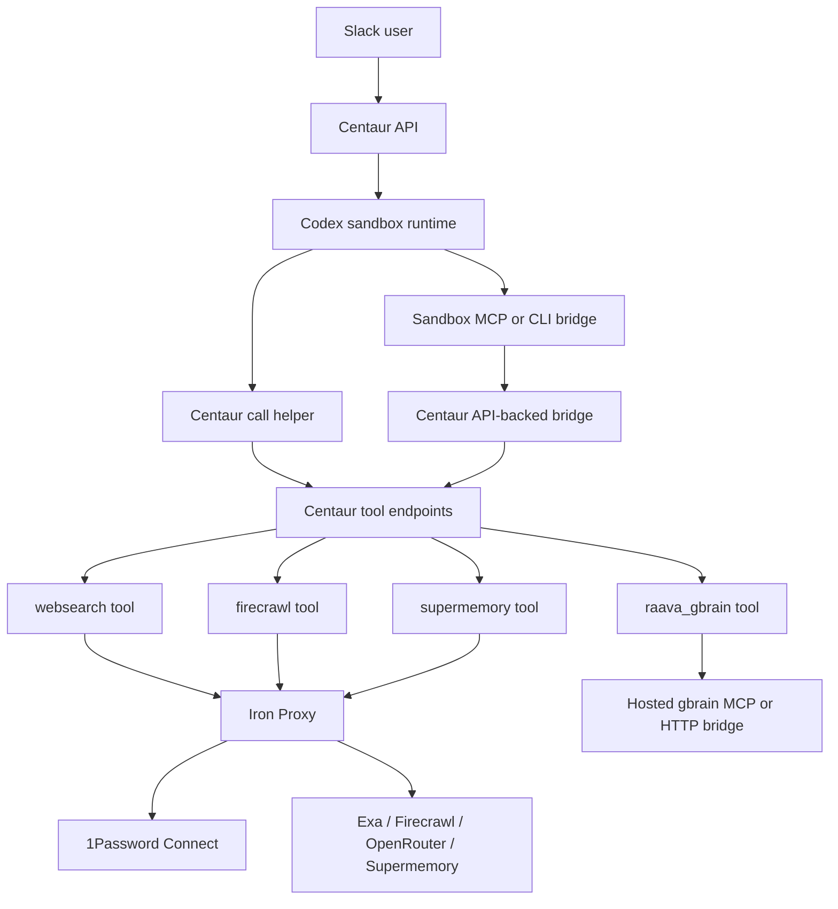

# feat: Integrate Centaur Codex memory, gbrain, and search

## Summary

Integrate Supermemory, hosted gbrain grounding, Firecrawl, and OpenRouter-backed synthesis into the Raava Internal Centaur Codex sandbox. The plan keeps provider keys in 1Password-backed Centaur infrastructure, makes Exa and Firecrawl available without Anthropic, and gives Codex a stable MCP/CLI surface inside Slack-driven sandboxes.

**Target repo:** `centaur`

---

## Problem Frame

The local Raava Internal Centaur deployment now has working Slack ingress, Codex OAuth, 1Password Connect secret resolution, and Exa-backed raw search. The current failure mode is visible in Slack: `websearch search` succeeds when `synthesize=false`, but richer `websearch` paths fail because synthesis and deep research require `ANTHROPIC_API_KEY`. Firecrawl is present in the Raava vault by item title, but it is not registered as a Centaur tool.

The Codex sandbox also does not inherit the Mac host's MCP configuration. The host already has a `gbrain-hosted` MCP entry, but the sandbox image copies `harness/codex/config.toml` into the runtime. Any Supermemory or hosted gbrain integration that matters for Slack must be assembled through Centaur's sandbox config path, not through a one-off host-level `codex mcp add`.

---

## Assumptions

- The integration targets the local production-shaped deployment first, using `overlays/raava-internal/deploy/values.raava-local-connect.yaml`.
- The Raava vault item titles available for this work are `SUPERMEMORY_API_KEY`, `OPENROUTER_API_KEY`, `EXA_API_KEY`, and `FIRECRAWL_API_KEY`.
- Anthropic should remain an optional compatibility provider, not a required dependency for ordinary web research.
- Hosted gbrain remains the canonical Raava knowledge surface. The existing local `gbrain` CLI is not sufficient proof of hosted MCP access.

---

## Requirements

**Secret Boundary**

- R1. Provider credentials for Supermemory, OpenRouter, Exa, Firecrawl, and hosted gbrain must resolve from 1Password-backed infrastructure, not committed config files or copied Slack-thread text.
- R2. Sandbox-visible config may contain placeholders, project names, provider URLs, or Centaur API credentials that already exist for tool calls, but it must not contain raw provider API keys.
- R3. Missing optional provider credentials must produce clear capability-unavailable output rather than silently falling back to the wrong provider.

**Codex Sandbox Context**

- R4. Codex sandboxes must expose a memory capability backed by Supermemory.
- R5. Codex sandboxes must expose hosted gbrain grounding through MCP or an equivalent CLI/tool bridge.
- R6. The live sandbox verification must prove the MCP or CLI surface inside a Centaur sandbox, not only on the Mac host.

**Search And Research**

- R7. `websearch search` must work with Exa retrieval without requiring Anthropic.
- R8. Synthesized `websearch` answers must be configurable to use OpenRouter with a DeepSeek model when `OPENROUTER_API_KEY` is available.
- R9. `websearch deep_research` must not be hard-coded to Anthropic-only planner, reviewer, writer, and citation-repair calls.
- R10. Firecrawl must be available as a first-class Centaur tool for search and page scrape workflows.
- R11. Agent-facing instructions must make the difference between native Codex web search and Centaur's `websearch` / Firecrawl tools clear.

**Operational Verification**

- R12. The runbook must include title-only 1Password checks, sandbox capability checks, and Slack smoke scenarios for Exa, Firecrawl, OpenRouter synthesis, Supermemory, and hosted gbrain.
- R13. Tests must cover secret registration, config assembly, provider selection, and missing-secret failure paths.

---

## Acceptance Examples

- AE1. Given a Slack user asks Centaur to try Firecrawl or Exa, when Firecrawl is configured, then Centaur can use Firecrawl instead of saying it is unavailable.
- AE2. Given a Slack user asks for raw web results, when only `EXA_API_KEY` is present, then `websearch search` returns Exa results without an Anthropic error.
- AE3. Given a Slack user asks for a synthesized source-backed answer, when `OPENROUTER_API_KEY` is present and Anthropic is absent, then `websearch` uses OpenRouter/DeepSeek and reports provider metadata in the response.
- AE4. Given a Codex sandbox starts under the Raava overlay, when the agent inspects MCP or its equivalent CLI bridge, then Supermemory and hosted gbrain capabilities are visible from inside the sandbox.
- AE5. Given hosted gbrain is unavailable or lacks scope, when a persona needs Raava org facts, then the answer reports grounding unavailable or uses the deterministic local baseline rather than inventing roster claims.

---

## High-Level Technical Design

The preferred production-shaped path is a Centaur-owned bridge inside the sandbox. Codex sees MCP or CLI tools, but the provider credentials remain on the API/proxy side. Direct remote MCP configuration is useful for host-local operator setup, but it is not the default sandbox path unless Centaur can route its authorization headers through the same controlled proxy and placeholder-secret system.

---

## Key Technical Decisions

- KTD1. **Treat current `websearch` as a Centaur tool feature, not Codex native web search.** The Slack failure came from `tools/research/websearch`, which performs Exa retrieval and Anthropic-backed synthesis. Codex's own web-search setting is separate and should not be the primary Raava Slack research surface because it bypasses Centaur's tool registry, OP-backed secret contract, and tool observability.
- KTD2. **Split retrieval from synthesis.** Exa and Firecrawl retrieval should work without any LLM synthesis key. Synthesis provider selection should be explicit, with OpenRouter/DeepSeek preferred for Raava dogfood and Anthropic retained only as an optional fallback.
- KTD3. **Expose Supermemory through a Centaur-secured bridge before direct API-key MCP.** Supermemory's remote MCP supports API-key auth, but putting the raw key in sandbox env weakens the boundary Centaur just established with 1Password Connect. A bridge lets Codex use MCP semantics while provider keys stay behind the API/proxy layer.
- KTD4. **Use hosted gbrain as the live grounding source and keep the local baseline as fallback.** Local `gbrain whoami` can report local transport while hosted MCP is the real shared Raava knowledge surface. The plan must verify hosted query/read behavior from the sandbox path.
- KTD5. **Make Firecrawl a tool, not just a prompt suggestion.** Agents should discover `firecrawl` through Centaur tool discovery with methods for search and scrape, backed by `FIRECRAWL_API_KEY` in OP.
- KTD6. **Keep sandbox config generated from repo/overlay inputs.** `services/sandbox/entrypoint.sh` copies the baked harness config. Implementation should extend that assembly path rather than requiring manual edits to a running pod.

---

## Implementation Units

### U1. Secret inventory and OP-backed capability contract

- **Goal:** Normalize the expected secret item titles, field names, and capability flags for the integration.
- **Requirements:** R1, R2, R3, R12.
- **Dependencies:** None.
- **Files:** `overlays/raava-internal/deploy/runbook.md`, `overlays/raava-internal/deploy/values.raava-local-connect.yaml`, `docs/pages/secrets/onepassword.mdx`.
- **Approach:** Extend the local Connect runbook from Exa/Firecrawl to the full capability set. Document item titles, required `credential` field, and which features each item unlocks. Keep the check title-only and avoid commands that print secret values.
- **Patterns to follow:** Existing 1Password Connect runbook section in `overlays/raava-internal/deploy/runbook.md`; secret source vocabulary in `CONCEPTS.md`.
- **Test scenarios:** Test expectation: none -- this unit is documentation and deployment contract clarification.
- **Verification:** A reviewer can identify which missing vault item disables which feature without reading implementation code or exposing secret values.

### U2. Sandbox Codex MCP and CLI bridge assembly

- **Goal:** Add a durable way for Raava Codex sandboxes to receive MCP or equivalent CLI capabilities for Supermemory and hosted gbrain.
- **Requirements:** R2, R4, R5, R6, R11, R13.
- **Dependencies:** U1.
- **Files:** `harness/codex/config.toml`, `services/sandbox/entrypoint.sh`, `services/sandbox/Dockerfile`, `services/sandbox/SYSTEM_PROMPT.md`, `overlays/raava-internal/services/sandbox/SYSTEM_PROMPT.md`, `services/api/tests/test_sandbox_entrypoint.py`.
- **Approach:** Add a sandbox-local bridge command that Codex can start as an MCP stdio server or call as a CLI. The bridge should call Centaur API tool endpoints using the existing sandbox API credential, so provider keys remain API-side. The entrypoint should assemble the bridge config from baked defaults plus overlay-specific additions.
- **Execution note:** Start with entrypoint/config tests that prove the final `.codex/config.toml` contains the bridge entries only when the overlay or capability flag is active.
- **Patterns to follow:** Harness config install behavior in `services/sandbox/entrypoint.sh`; Codex MCP tables under `[mcp_servers.<id>]`; existing `call` helper pattern in `services/sandbox/SYSTEM_PROMPT.md`.
- **Test scenarios:** Verify base sandboxes keep the existing Codex config unchanged; verify Raava overlay sandboxes include Supermemory and hosted gbrain bridge entries; verify the bridge command receives only Centaur API env, not raw provider keys; verify missing bridge binary or disabled config leaves Codex startup healthy with a clear unavailable note.
- **Verification:** A sandbox launched under the Raava overlay can list the bridge capabilities from inside the container, while its env does not contain raw `SUPERMEMORY_API_KEY`, `OPENROUTER_API_KEY`, `EXA_API_KEY`, or `FIRECRAWL_API_KEY` values.

### U3. Supermemory-backed memory tool and Codex bridge exposure

- **Goal:** Make Supermemory available to Codex agents as persistent memory for Raava Centaur work.
- **Requirements:** R1, R2, R3, R4, R6, R12, R13.
- **Dependencies:** U1, U2.
- **Files:** `tools/memory/supermemory/pyproject.toml`, `tools/memory/supermemory/client.py`, `tools/memory/supermemory/README.md`, `services/api/tests/test_tool_manager.py`, `services/api/tests/test_proxy_config.py`, `overlays/raava-internal/deploy/runbook.md`.
- **Approach:** Create a Centaur tool that exposes narrow memory operations such as recall, write, and identity/context check. Declare `SUPERMEMORY_API_KEY` as an HTTP secret for `mcp.supermemory.ai` or the relevant Supermemory API host. The Codex bridge should expose the same operations through MCP while routing through the Centaur API.
- **Patterns to follow:** Tool plugin metadata and secret parsing in `services/api/api/tool_manager.py`; proxy secret rendering tests in `services/api/tests/test_proxy_config.py`; Supermemory MCP's API-key and project-scoping headers.
- **Test scenarios:** Verify the tool is discoverable; verify secret metadata produces a host-scoped bearer credential; verify recall/write calls use placeholders in test mode; verify missing `SUPERMEMORY_API_KEY` returns capability-unavailable; verify the bridge maps MCP calls to the same API tool methods.
- **Verification:** In a Raava sandbox, an agent can store a harmless test memory and recall it through the Codex bridge without the raw key appearing in sandbox config.

### U4. Hosted gbrain bridge hardening

- **Goal:** Upgrade Raava gbrain grounding from local fallback plus ad hoc host MCP into a sandbox-verifiable hosted path.
- **Requirements:** R1, R2, R3, R5, R6, R12, R13.
- **Dependencies:** U1, U2.
- **Files:** `overlays/raava-internal/tools/raava_gbrain/client.py`, `overlays/raava-internal/tools/raava_gbrain/pyproject.toml`, `services/api/tests/test_raava_internal_overlay.py`, `overlays/raava-internal/services/sandbox/SYSTEM_PROMPT.md`, `overlays/raava-internal/deploy/runbook.md`.
- **Approach:** Preserve the deterministic local baseline, but add a hosted adapter that matches the real hosted gbrain behavior and parses SSE-style MCP responses when needed. The adapter should expose the same roster, role lookup, and decision search contract to personas and the Codex bridge.
- **Patterns to follow:** Current `raava_gbrain` local fallback tests; prior hosted gbrain lessons that separate local CLI transport from hosted MCP queryability.
- **Test scenarios:** Verify local baseline still returns the eight lead roster when hosted config is absent; verify hosted responses are normalized into the existing tool contract; verify SSE `data:` payloads are parsed; verify insufficient scope or service unavailability returns grounding-unavailable metadata rather than false local success when hosted mode is required.
- **Verification:** A live sandbox smoke proves a hosted gbrain query or page read succeeds through the Raava path, and a negative-scope case is reported clearly.

### U5. OpenRouter synthesis provider for websearch

- **Goal:** Remove the Anthropic hard requirement from synthesized websearch answers and deep research.
- **Requirements:** R1, R3, R7, R8, R9, R11, R12, R13.
- **Dependencies:** U1.
- **Files:** `tools/research/websearch/client.py`, `tools/research/websearch/cli.py`, `tools/research/websearch/pyproject.toml`, `tools/research/websearch/README.md`, `tools/research/websearch/tests/test_client.py`, `services/api/tests/test_proxy_config.py`, `overlays/raava-internal/deploy/runbook.md`.
- **Approach:** Introduce synthesis provider selection with OpenRouter as the Raava dogfood default when `OPENROUTER_API_KEY` exists. Keep Exa retrieval independent from synthesis. Adapt planner, reviewer, report writer, and citation repair behind a provider-neutral text/json completion interface.
- **Execution note:** Add unit coverage for provider selection and missing-secret behavior before modifying the research pipeline.
- **Patterns to follow:** Existing `_call_claude_text` and `_call_claude_json` call sites; OpenRouter's OpenAI-compatible `/api/v1/chat/completions` endpoint; existing `--no-synthesize` CLI behavior.
- **Test scenarios:** Verify `search(..., synthesize=False)` requires only Exa; verify `search(..., synthesize=True)` uses OpenRouter when OpenRouter is configured and Anthropic is absent; verify Anthropic still works when explicitly selected; verify `deep_research` uses the provider-neutral completion interface for all model calls; verify OpenRouter auth failure names `OPENROUTER_API_KEY`, not Anthropic.
- **Verification:** The Slack screenshot failure mode is gone: synthesized websearch no longer fails with `ANTHROPIC_API_KEY not set` when OpenRouter is configured.

### U6. Firecrawl research tool

- **Goal:** Register Firecrawl as a Centaur tool that agents can discover and use directly.
- **Requirements:** R1, R2, R3, R10, R11, R12, R13.
- **Dependencies:** U1.
- **Files:** `tools/research/firecrawl/pyproject.toml`, `tools/research/firecrawl/client.py`, `tools/research/firecrawl/cli.py`, `tools/research/firecrawl/README.md`, `tools/research/firecrawl/tests/test_client.py`, `services/api/tests/test_tool_manager.py`, `services/api/tests/test_proxy_config.py`, `overlays/raava-internal/deploy/runbook.md`.
- **Approach:** Implement a small Firecrawl client with `search` and `scrape` first. Use HTTP secret metadata for `FIRECRAWL_API_KEY` as a bearer token on `api.firecrawl.dev`. Do not add crawl/agentic-browser operations until the bounded search/scrape path is stable.
- **Patterns to follow:** Websearch CLI/client packaging; Firecrawl docs for search and scrape; Centaur typed HTTP secret metadata.
- **Test scenarios:** Verify the tool is discoverable; verify `search` accepts query plus result count and can request markdown content; verify `scrape` accepts one URL and returns markdown; verify missing `FIRECRAWL_API_KEY` returns a clear unavailable error; verify proxy metadata injects `Authorization` only for `api.firecrawl.dev`.
- **Verification:** A Slack user can ask for Firecrawl explicitly and the agent can call a real `firecrawl` tool instead of reporting it unavailable.

### U7. Agent instructions and runbook smoke matrix

- **Goal:** Make agents and operators choose the correct research surface and verify the full integration end to end.
- **Requirements:** R6, R11, R12, R13.
- **Dependencies:** U2, U3, U4, U5, U6.
- **Files:** `services/sandbox/SYSTEM_PROMPT.md`, `overlays/raava-internal/services/sandbox/SYSTEM_PROMPT.md`, `overlays/raava-internal/deploy/runbook.md`, `docs/solutions/integration-issues/local-kind-codex-blank-responses-placeholder-api-key.md`.
- **Approach:** Update sandbox instructions so agents know to use Centaur tools for provider-backed web research, Firecrawl for scrape/search workflows, Supermemory for persistent cross-turn memory, and hosted gbrain for Raava facts. Add a smoke matrix that checks discovery, raw Exa, Firecrawl, OpenRouter synthesis, Supermemory memory, hosted gbrain, and Slack response behavior.
- **Patterns to follow:** Existing "Authoritative deployment-capability answers" guidance in `services/sandbox/SYSTEM_PROMPT.md`; Codex OAuth troubleshooting doc in `docs/solutions/integration-issues/local-kind-codex-blank-responses-placeholder-api-key.md`.
- **Test scenarios:** Test expectation: none -- this unit is prompt/runbook work, with behavioral proof covered by the integration smokes in prior units.
- **Verification:** The runbook can reproduce the screenshot scenario and show the corrected tool choices from Slack.

---

## Scope Boundaries

### In Scope

- Local Docker/Kind, production-shaped secret handling.
- Raava overlay behavior and sandbox configuration.
- Exa raw search, Firecrawl search/scrape, OpenRouter synthesis, Supermemory memory, and hosted gbrain grounding.
- Tests and runbooks that prove behavior inside the Centaur sandbox.

### Deferred to Follow-Up Work

- Full Firecrawl crawl, map, extract, browser interact, or long-running agent jobs.
- Per-user Supermemory namespaces or Slack-user identity mapping beyond a deployment/project scope.
- Production GitOps and cloud rollout beyond the local production-shaped deployment.
- Migrating hosted gbrain infrastructure itself.

### Out of Scope

- Making Anthropic mandatory for Raava internal web research.
- Treating Codex native web search as a replacement for Centaur's observable tool surface.
- Copying raw OP secret values into harness config, committed files, or Slack messages.

---

## System-Wide Impact

This integration crosses the sandbox runtime, tool registry, proxy-secret layer, Raava overlay, and Slack UX. The main platform impact is a new pattern for sandbox-level MCP or CLI capabilities that are backed by Centaur API tools instead of direct provider credentials.

The work also changes research behavior. After this plan ships, "websearch failed because Anthropic is missing" should no longer be the default result for normal Raava research. Provider selection becomes an explicit deployment capability that can be inspected and tested.

---

## Risks And Dependencies

- **Secret-boundary regression:** Direct remote MCP is simpler but can leak provider keys into sandbox env. Mitigate by making the Centaur bridge the default and testing for absent raw keys.
- **Codex MCP startup fragility:** Required MCP servers can break sandbox startup. Mitigate by keeping bridge entries non-required until the smoke matrix proves stability.
- **Hosted gbrain transport mismatch:** Hosted `/mcp` can return SSE-style payloads. Mitigate with parser coverage and an explicit hosted smoke.
- **OpenRouter model drift:** DeepSeek model slugs, pricing, and provider routing can change. Mitigate with a config-driven model name and clear provider metadata in responses.
- **Tool sprawl:** Adding both Firecrawl and websearch can confuse agents. Mitigate with prompt guidance and discoverable method descriptions that distinguish retrieval, scrape, and synthesis.

---

## Sources And Research

- Existing Raava Internal Centaur requirements: `docs/brainstorms/2026-06-11-raava-internal-centaur-requirements.md`.
- Completed Raava Internal Centaur plan: `docs/plans/2026-06-11-001-feat-raava-internal-centaur-plan.md`.
- Current sandbox config path: `harness/codex/config.toml`, `services/sandbox/entrypoint.sh`, `services/sandbox/Dockerfile`, `services/api/tests/test_sandbox_entrypoint.py`.
- Current websearch Anthropic coupling: `tools/research/websearch/client.py`, `tools/research/websearch/pyproject.toml`, `tools/research/websearch/README.md`.
- Current Raava gbrain fallback tool: `overlays/raava-internal/tools/raava_gbrain/client.py`, `services/api/tests/test_raava_internal_overlay.py`.
- Current Connect-backed local deployment docs: `overlays/raava-internal/deploy/runbook.md`, `overlays/raava-internal/deploy/values.raava-local-connect.yaml`.
- Codex MCP configuration docs: <https://developers.openai.com/codex/mcp>.
- Codex config reference for MCP server fields: <https://developers.openai.com/codex/config-reference>.
- Supermemory MCP setup and API-key/project scoping docs: <https://supermemory.ai/docs/supermemory-mcp/setup>.
- OpenRouter chat completions and authentication docs: <https://openrouter.ai/docs/quickstart>, <https://openrouter.ai/docs/api/reference/authentication>.
- Firecrawl introduction, search, and scrape docs: <https://docs.firecrawl.dev/api-reference/introduction>, <https://docs.firecrawl.dev/api-reference/endpoint/search>, <https://docs.firecrawl.dev/api-reference/endpoint/scrape>.
