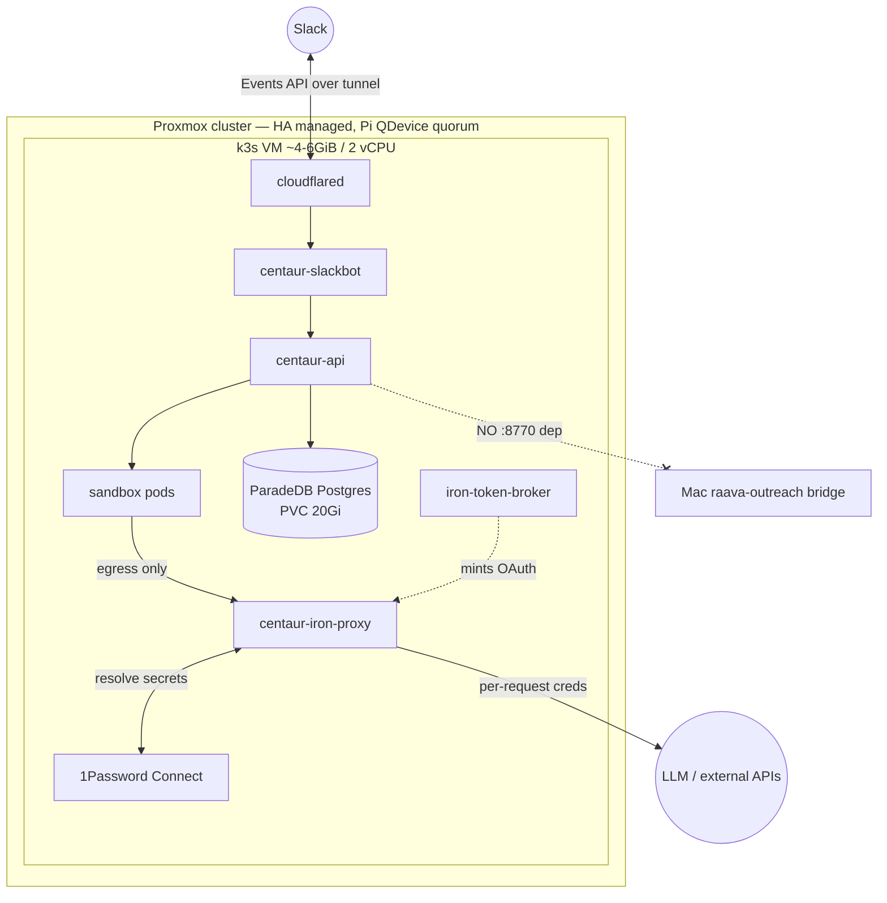
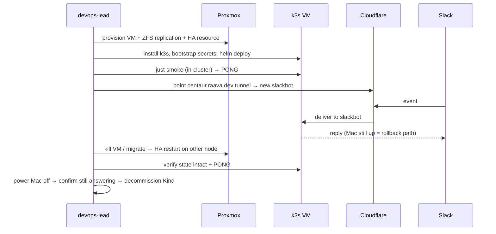

# feat: Migrate Centaur off the Mac Studio onto the Proxmox cluster

## Summary

Stand up the Centaur k8s platform as a standalone k3s VM on the Proxmox cluster (`pve-01`/`pve-02` + Pi QDevice), under Proxmox HA for reliable uptime, and cut over from the Mac Studio Kind cluster. Decouple the interim `:8770` raava-outreach bridge so the deployment has no dependency on the Mac. State (ParadeDB Postgres) persists on a PVC; Slack reaches it through the existing Cloudflare tunnel. Execution seat: `devops-lead` (the one app-code unit, U4, routes to the engineer).

## Problem Frame

Centaur runs today on a Kind cluster on the Mac Studio — tied to a workstation that sleeps, reboots, and is needed for other work, and currently down. Centaur is our agent; it should be always-on infra. The Proxmox cluster is the home. This plan is a host migration, not a re-architecture: the Helm chart, services, and secret model are unchanged; what changes is where they run and the removal of the Mac-coupled `:8770` dependency.

---

## Requirements

**Standalone & decoupling**
- R1. Centaur on Proxmox has no runtime dependency on the Mac Studio or the raava-outreach `:8770` bridge.
- R2. No code path Centaur deploys references `host.docker.internal:8770` or hard-fails when the bridge is absent.

**Uptime & HA**
- R3. A reboot recovers Centaur automatically (auto-start on pve-01). **Node-loss failover to the other node is deferred** until ZFS disks are added (interim local-lvm decision, 2026-06-29) — tracked as hardening follow-up.

**Deployment**
- R4. Centaur deploys via the existing Helm chart + `raava-internal` overlay on k3s, reproducibly from a committed values file.
- R5. Slack reaches the slackbot through the Cloudflare tunnel with no inbound port exposed on the Proxmox host.

**State**
- R6. Postgres data survives pod restarts and node failover (PVC on replicated/shared storage), with an off-box backup.

**Secrets**
- R7. Secrets resolve from 1Password Connect on the cluster with a writable token, and the codex/OAuth harness path authenticates (token-broker enabled).

**Verification**
- R8. Centaur is reachable and answers in Slack with the Mac Studio powered off, and HA failover is demonstrated before the Mac path is decommissioned.

---

## Key Technical Decisions

- **k3s on a VM, not LXC**: containerd/k3s in an LXC is fragile (nesting, kernel modules); a VM is the supported, clean path and matches the chart's `mac-mini-setup.mdx` "k3s on a small always-on host" model.
- **HA via Proxmox VM management, single k3s-node VM**: the VM is HA/auto-start managed so it restarts on host reboot. **Interim (decided 2026-06-29): provision on `local-lvm` on pve-01** — the nodes have no ZFS pool or second disk yet, and Proxmox replication is ZFS-only, so cross-node failover is NOT available until disks are added. This delivers reboot-resilience now (a big step up from the Mac) but leaves R3's node-loss arm unmet until the disk-hardening follow-up. Quorum (Pi QDevice) is already satisfied for when ZFS lands.
- **Disk-hardening is a follow-up, not a blocker**: add a dedicated disk to pve-01 + pve-02 → ZFS pool → ZFS replication → true cross-node HA failover. Tracked in Scope Boundaries; U2 is a no-op until then.
- **Postgres stays in-cluster on a PVC** (ParadeDB), not externalized: matches the chart default (`volumeClaimTemplate`, 20Gi), no new managed-DB dependency; durability comes from the replicated VM disk + nightly `pg_dump` off-box.
- **Decouple `:8770` by inverting the default to disabled**: today an unset `RAAVA_OUTREACH_BASE_URL` *defaults to the Mac bridge* (`tools/raava_outreach/client.py`), so "do nothing" stays coupled. The decouple inverts that — unset/empty = disabled → the GTM workflow skips `produce()` and posts the renderers' existing "no signals" state; only an explicitly-set reachable URL runs produce. Intake redesign deferred (origin scope).
- **Migrate Postgres state via `pg_dump`/restore (default)**: preserve existing thread/transcript/persona/GTM state — dump the Mac Kind Postgres, restore into the VM PVC before cutover. Fresh-start is acceptable only if the Kind data is confirmed throwaway (Open Questions). Preserve-by-default because the loss is irreversible and the dump is cheap.
- **Build images on the VM, import into k3s containerd**: `just build` produces Docker images; k3s does not read the Docker daemon, so they must be `docker save` → `k3s ctr images import`'d, and prod values set `pullPolicy: IfNotPresent` for all **five** images (api, slackbot, iron-proxy, sandbox, + the `raava-centaur-overlay` overlay image). Requires Docker on the VM.
- **token-broker enabled with a writable Connect token, single active broker**: rc.2 blocks access-token issuance on a failed write-back, so the in-cluster Connect token MUST have write scope on the Engineering vault — a hard requirement, not just durability. Only one broker may be live at a time (Mac vs VM) or they rotation-fight over the shared OAuth refresh token (see Risks).

---

## High-Level Technical Design

**Target topology** (single k3s VM, HA-managed across the cluster):

**Cutover sequence** (Mac stays warm until HA is proven):

---

## Implementation Units

Grouped into three phases. `devops-lead` owns A and C and the infra parts of B; U4 (app code) routes to the engineer.

### Phase A — Foundation

### U1. Provision the k3s host VM on Proxmox
- **Goal**: An always-on Linux VM on the cluster, on the tailnet, sized for Centaur.
- **Requirements**: R3, R4
- **Dependencies**: none
- **Files**: `overlays/raava-internal/deploy/runbook.md` (extend the existing runbook — add the Proxmox section, don't fork a new file)
- **Approach**: Debian/Ubuntu headless VM on `pve-01` (primary), **8 GiB RAM** (4 GiB OOMs once ParadeDB + 8 pods + a sandbox are co-resident), 2 vCPU, ≥40 GiB disk (20Gi Postgres PVC + OS + image cache). Install **Docker** (image build, U6). Enable `systemd-timesyncd` — OAuth/token/k8s-cert validation is clock-sensitive on a fresh VM. Reserved IP; join Tailscale via pre-auth key (the cluster + Mac already share the tailnet). Disk on **`local-lvm` on pve-01** (interim — no ZFS pool exists; cross-node replication deferred to disk-hardening). Avoid VMID 100 (orphaned `pve-vm-100-disk-0` present). No inbound ports — all ingress arrives via the cloudflared tunnel (U7).
- **Patterns to follow**: existing tailnet hosts (`pve-01`, `pve-02`, `ubuntu-server` are already `tagged-devices`).
- **Test scenarios**: Test expectation: none — infra provisioning. Verify by outcome below.
- **Verification**: VM boots headless, reachable over the tailnet by hostname, survives a manual reboot, disk sits on the ZFS pool.

### U2. Auto-restart now; cross-node HA deferred to disk-hardening
- **Goal**: The VM auto-restarts on pve-01 reboot now; full cross-node failover lands when ZFS disks are added.
- **Requirements**: R3 (reboot arm only; node-loss arm deferred), R6
- **Dependencies**: U1
- **Files**: `overlays/raava-internal/deploy/runbook.md`
- **Approach**: **Interim (local-lvm):** add the VM as a Proxmox HA resource / set auto-start so it comes back on a pve-01 reboot. ZFS replication is a **no-op now** — no ZFS pool exists and replication is ZFS-only, so the disk lives only on pve-01 and cannot fail over to pve-02. Do NOT improvise destructive boot-disk repartitioning. **Hardening (when disks arrive):** `zpool create` on both nodes, migrate the VM disk to ZFS, add a `pve-01`→`pve-02` replication job (5–15 min), and the node-loss arm of R3 is met.
- **Patterns to follow**: existing pve-01/pve-02 + `raspberrypi` QDevice quorum (already votable for the future ZFS case).
- **Test scenarios**: Test expectation: none — infra config.
- **Verification**: `ha-manager status` (or `qm` onboot) shows the VM auto-restarts after a pve-01 reboot. Record explicitly in the runbook that cross-node failover is NOT yet available.

### U3. Install k3s + sandbox runtime prerequisites
- **Goal**: A working single-node k3s able to run the chart and spawn sandbox pods.
- **Requirements**: R4
- **Dependencies**: U1
- **Files**: `overlays/raava-internal/deploy/runbook.md`
- **Approach**: Install k3s single-node (its bundled containerd + local-path provisioner serve the Postgres PVC, backed by the replicated VM disk). Note k3s containerd is **separate from the Docker daemon** — images built in U6 are imported via `k3s ctr images import` (not visible to k3s otherwise). Verify the `agent-sandbox` controller (`v0.4.6`, a chart dep) installs and its CRDs reconcile; confirm containerd can run the sandbox image and the default-deny NetworkPolicies apply. Set the default storageClass for the Postgres PVC (local-path) explicitly in the prod values (U6).
- **Patterns to follow**: chart deps in `contrib/chart/Chart.yaml`; sandbox model in `services/sandbox/`.
- **Test scenarios**: Test expectation: none — runtime install; covered by U6 deploy + U8 smoke.
- **Verification**: `kubectl get nodes` Ready; a throwaway PVC binds on local-path; the agent-sandbox controller pod is Running with CRDs present.

### Phase B — Platform prep

### U4. Decouple the `:8770` raava-outreach bridge
- **Goal**: Centaur no longer depends on the Mac bridge; the GTM daily workflow degrades cleanly instead of hard-failing.
- **Requirements**: R1, R2
- **Dependencies**: none (can land before or parallel to Phase A)
- **Files**: `overlays/raava-internal/tools/raava_outreach/client.py`, `overlays/raava-internal/workflows/gtm_outreach_daily.py`, `overlays/raava-internal/workflows/test_gtm_outreach_daily.py` (existing — pin as the gate)
- **Approach**: **Invert the default coupling.** Today the client's `_DEFAULT_BASE_URL` is `http://host.docker.internal:8770`, so an unset env var hits the Mac bridge (which won't resolve on k3s → `httpx` error → `RuntimeError`). Change so empty/unset `RAAVA_OUTREACH_BASE_URL` = **disabled**. The workflow calls the *tool* (`ctx.call_tool("raava_outreach", "produce", …)`, line 56), so place the guard in the workflow: when disabled, skip the produce call and render the empty state (`build_gtm_report_blocks({})` / `report_text({})` already return "no signals today"). Do not rebuild intake — Slack-landing-zone intake is deferred (Scope Boundaries).
- **Execution note**: Implement test-first against `test_gtm_outreach_daily.py` — this is the unit that must not silently break or silently re-couple the workflow.
- **Patterns to follow**: `_gtm_report_blocks.py` empty-dict render path; the structural send-gate's fail-closed posture.
- **Test scenarios**:
  - Edge (default): `RAAVA_OUTREACH_BASE_URL` unset/empty → workflow does NOT call the Mac bridge, renders the "no signals" state, does not raise. Covers R1, R2.
  - Happy path: env set to a reachable URL → workflow calls `produce()` and renders drafts as today.
  - Error: env set but connection refused/timeout → caught, renders empty state, workflow completes (no raise).
- **Verification**: the three branches pass in `test_gtm_outreach_daily.py`; grep of the deployed image shows no startup path that dials `host.docker.internal:8770`.

### U5. Stand up 1Password Connect, secrets, and the token-broker
- **Goal**: Secrets resolve on the new cluster and the codex/OAuth harness authenticates.
- **Requirements**: R7
- **Dependencies**: U3
- **Files**: `overlays/raava-internal/deploy/values.raava-proxmox.yaml` (new), referencing the pattern in `overlays/raava-internal/deploy/values.raava-local-connect.yaml`; `contrib/scripts/bootstrap-k8s-secrets.sh` (reuse)
- **Approach**: Provide the 5 bootstrap env vars (`OP_SERVICE_ACCOUNT_TOKEN`, `OP_VAULT`, `SLACK_BOT_TOKEN`, `SLACK_SIGNING_SECRET`, `SLACKBOT_API_KEY`); run `just bootstrap-secrets` (generates `POSTGRES_PASSWORD`/`DATABASE_URL`/`IRON_MANAGEMENT_API_KEY`/`SANDBOX_SIGNING_KEY`/`IRON_BROKER_TOKEN` + firewall CA). In the prod values set `tokenBroker.enabled: true` and `ironProxy.secretSource`/`manager.secretSource: onepassword-connect`. Issue the in-cluster Connect token with **write** scope on the Engineering vault (read-only blocks broker issuance under rc.2). **Create the `centaur-codex-auth` secret** — bootstrap does NOT (it's a manual `kubectl create secret generic centaur-codex-auth …`), and the sandbox references it via `sandbox.codexAuth.existingSecretName`; a missing secret = sandbox pods fail to start. Resolve the codex-credential posture here, not later (Open Questions): either seed `centaur-codex-auth` from a credential (default: the shared `~/.codex` lineage, accepting the one-time laptop re-login after first broker rotation) or null out `codexAuth.existingSecretName` and rely on the broker alone.
- **Patterns to follow**: `overlays/raava-internal/deploy/values.raava-local-connect.yaml`; the `centaur-codex-auth` step in `overlays/raava-internal/deploy/runbook.md`; the bring-up history in the origin doc.
- **Test scenarios**: Test expectation: none — secret wiring; verified operationally.
- **Verification**: Connect write-probe returns 200; broker serves a bearer (200) and writes back (200); `centaur-infra-env` + `centaur-codex-auth` present; a sandbox pod reaches Running.

### U6. Image distribution + Helm deploy
- **Goal**: All services running on k3s from a committed prod values file.
- **Requirements**: R4, R5, R6
- **Dependencies**: U3, U4, U5
- **Files**: `overlays/raava-internal/deploy/values.raava-proxmox.yaml`, `overlays/raava-internal/deploy/cloudflared-centaur.yaml` (reuse), `Justfile` (a deploy target if the existing one needs a values override)
- **Approach**: Build **all five** images on the VM with Docker (`just build` = `docker build`), then `docker save` the set and `sudo k3s ctr images import` them into k3s containerd (k3s does not read the Docker daemon — this is the documented `mac-mini-setup.mdx` flow). Author `values.raava-proxmox.yaml`: **`pullPolicy: IfNotPresent` for all five images** (chart default is `Always` → ImagePullBackOff for locally-imported images), explicit `storageClassName` (local-path) + `persistence.size` for Postgres, resource requests/limits per the 8 GiB sizing (so the sandbox warm-pool can't evict core pods), `tokenBroker.enabled`, `secretSource: onepassword-connect`, the overlay image (`raava-centaur-overlay`), and the cloudflared deployment. Deploy into namespace **`centaur`** (NOT `centaur-system` — `cloudflared-centaur.yaml`, bootstrap, and the `just` targets all hardcode/default `centaur`): `helm upgrade --install centaur contrib/chart -n centaur -f <raava-internal overlay values> -f values.raava-proxmox.yaml`.
- **Patterns to follow**: `just deploy`; `docs/pages/mac-mini-setup.mdx` (ctr-import flow) and `docs/pages/deploying-in-production.mdx` (`pullPolicy: IfNotPresent`); `overlays/raava-internal/deploy/values.raava-local.yaml` (the 5th overlay image + codexAuth wiring); `contrib/chart/templates/workloads.yaml` PVC template.
- **Test scenarios**: Test expectation: none — deployment; covered by U8.
- **Verification**: `k3s ctr images ls` shows all five tags before deploy; all pods Ready in ns `centaur` (api 2/2, slackbot, iron-proxy, token-broker, connect, postgres, cloudflared) with no ImagePullBackOff; Postgres PVC Bound; `just status` clean.

### Phase C — Cutover & verification

### U7. Cloudflare tunnel cutover
- **Goal**: Slack events reach the new cluster's slackbot.
- **Requirements**: R5
- **Dependencies**: U6
- **Files**: `overlays/raava-internal/deploy/cloudflared-centaur.yaml`
- **Approach**: The tunnel ID + credential are a single shared value — two cloudflared origins on the **same named tunnel are load-balanced by Cloudflare**, so Mac + VM would both receive Slack events and both reply (split-brain). Cutover is therefore an **atomic origin swap, not a warm dual-run**: scale the Mac cloudflared to 0 *as* the VM cloudflared connects, so exactly one origin serves `centaur.raava.dev → centaur-centaur-slackbot:3001` at a time. The Slack app event URL stays `centaur.raava.dev` (no Slack-side change). Rollback = stop VM cloudflared, restart the Mac one (the Mac *cluster* stays warm; its *tunnel* does not run concurrently).
- **Patterns to follow**: the existing tunnel manifest (`cloudflared-centaur.yaml`, hostname → `centaur-centaur-slackbot:3001`, ns `centaur`).
- **Test scenarios**: Test expectation: none — routing; verified in U8 smoke.
- **Verification**: only the VM cloudflared is connected (Cloudflare dashboard shows one healthy origin); a Slack event is delivered to the new slackbot (logs), not the Mac; no duplicate replies.

### U8. End-to-end verification, HA failover drill, and Mac-off cutover
- **Goal**: Prove R3/R8 before retiring the Mac path.
- **Requirements**: R3, R6, R8
- **Dependencies**: U7
- **Files**: `overlays/raava-internal/deploy/runbook.md`
- **Approach**, ordered (single active broker + single active tunnel throughout): (1) **in-cluster smoke** on the VM before cutover — `just smoke` → PONG, and codex path returns `chatgpt.com` 200 (broker bearer injected); (2) **data migration** (unless Open-Questions chose fresh-start): `pg_dump` the Mac Kind Postgres → restore into the VM PVC; (3) **disable the Mac token-broker** (scale to 0) so only the VM broker writes the shared OAuth refresh token; (4) **atomic tunnel swap** (U7): scale Mac cloudflared to 0 as the VM connects; confirm Centaur answers in Slack with one origin; (5) **HA drill (measured, not asserted)**: write a known marker row, hard-stop the VM's node, let Proxmox HA restart the VM on the surviving node, then measure what was lost — expect RPO ≤ the replication interval and any in-flight execution dropped, RTO single-digit minutes; confirm the marker (minus at most one interval) survived; (6) **Mac-off check**: power the Mac Studio off, confirm Centaur still answers; (7) **decommission** the Mac Kind cluster + Mac launchd tunnel only after 1–6 pass.
- **Patterns to follow**: the origin doc's resolved smoke line (`#raava-core` C0BABKU5T36).
- **Test scenarios**: Test expectation: none — operational acceptance; the ordered steps ARE the gate.
- **Verification**: all steps pass; measured RPO/RTO recorded in the runbook; Mac powered off and Centaur reachable with no duplicate replies; Kind cluster decommissioned.

---

## Scope Boundaries

**In scope**: provisioning + HA + k3s, decoupling `:8770`, secrets/broker bring-up, Helm deploy, tunnel cutover, verification + rollback, Mac decommission.

### Deferred to Follow-Up Work
- **Disk-hardening for true HA**: add a dedicated disk to pve-01 + pve-02 → ZFS pool → replication → cross-node HA failover (R3 node-loss arm). Interim runs on local-lvm (reboot-resilient only). Decided 2026-06-29.
- GTM report-intake redesign (Slack landing zone as the produce source) — U4 only neutralizes the dependency.
- Optional: push images to GHCR / a local registry if build-on-VM rebuilds become a bottleneck.
- Optional: Terraform/IaC for the Proxmox VM — runbook-documented manual provisioning is sufficient for a one-time 2-node move.

### Outside this migration
- Migrating raava-outreach (the Routine plane) off the Mac — separate effort; it stays on the Mac.
- Multi-node k3s HA control plane — Proxmox VM-failover covers the uptime bar.

---

## Open Questions

Both have a default so execution is not blocked; override before U5/U8 if you disagree.

- **Postgres continuity**: migrate existing Kind state via `pg_dump`/restore (default — irreversible loss is the no-regret avoid), or start fresh if the Kind data is just dev/test noise from the build sessions?
- **Codex credential**: seed `centaur-codex-auth` from the shared `~/.codex` lineage (default — repeats the accepted one-time laptop re-login after first rotation), or provision a dedicated credential for Centaur (no laptop collision, extra setup)?
- **Image distribution** (deferred default): build-on-VM + `ctr import` (default — no registry infra); move to GHCR/local registry only if rebuilds get slow.

---

## Risks & Dependencies

- **Connect token write-scope (high)**: a read-only in-cluster Connect token silently blocks broker token issuance (rc.2 treats write-back as blocking). Mitigation: issue/reissue the token with write scope on Engineering as part of U5; verify the write-probe returns 200 before declaring U5 done.
- **Dual token-broker rotation fight (high)**: the Mac Kind and the VM both run `tokenBroker.enabled: true`; the broker is single-writer over the shared 1Password OAuth refresh-token row, so two live brokers invalidate each other in a rotation loop. Mitigation: exactly one active broker at all times — scale the Mac broker to 0 before the VM broker starts (U8 step 3).
- **Shared codex-credential collision (medium)**: seeding `centaur-codex-auth` from the shared `~/.codex` lineage means the broker's first rotation invalidates the Mac laptop's `~/.codex` (the previously-accepted tradeoff). Decision in Open Questions; if repeated, expect a one-time `codex login` on the laptop after first rotation.
- **Nonzero RPO/RTO on failover (medium)**: ZFS async replication (5–15 min) means a hard node loss can lose up to one interval of Postgres writes and **all in-flight sandboxes/executions** (they live on the single k3s node); RTO is single-digit minutes (VM boot → k3s → scheduling → WAL recovery → tunnel reconnect), not seconds. Acceptable for a daily-cadence operator — do not oversell as "zero loss." Mitigation: short interval + nightly `pg_dump`; shared storage (Ceph/NFS) gives zero-RPO if wanted later.
- **QDevice is also the DNS box (medium)**: the Pi (`raspberrypi`, 100.64.146.44) is both the corosync QDevice quorum witness and the tailnet AdGuard DNS. Pi-down + one-node-down = no quorum = no HA restart. Don't reboot the Pi during a failover window; note the dependency in the runbook.
- **Dependency**: 1Password Engineering vault reachable from the Proxmox network; Cloudflare tunnel credential valid for the new cluster; Docker present on the VM for the image build.

---

## Operational / Rollout Notes

- **Rollback**: until U8 passes, the Mac Kind *cluster* stays warm — but its tunnel and broker do NOT run concurrently with the VM's (split-brain / rotation-fight). Rollback = scale VM cloudflared + broker to 0, then restart the Mac cloudflared + broker; restore Postgres from the latest `pg_dump` if the VM corrupted state. No Slack-side change required. The Mac path is a sequential fallback, not a hot standby.
- **Backup**: nightly `pg_dump` off the VM (to the Mac or a tailnet share) before and after cutover.
- **Decommission**: only after the HA drill and Mac-off check pass — stop the Mac Kind cluster and the Mac launchd tunnel; raava-outreach launchd jobs stay (out of scope).
- **Commit discipline**: the prod values (`values.raava-proxmox.yaml`), runbook, and U4 code change are committed to the fork (`raava-solutions/centaur`, do not push to `origin`) so the deployment survives redeploys — prior Mac bring-up drift (uncommitted overlay edits, runtime-only egress patches) is the failure mode to avoid.

---

## Sources / Research

- Origin: `docs/brainstorms/2026-06-29-centaur-proxmox-migration-requirements.md` (resolved facts + sizing).
- Chart/storage: `contrib/chart/Chart.yaml`, `contrib/chart/templates/workloads.yaml` (Postgres `volumeClaimTemplate`), `contrib/chart/values.yaml`.
- Decouple target: `overlays/raava-internal/tools/raava_outreach/client.py`, `overlays/raava-internal/workflows/gtm_outreach_daily.py`, `overlays/raava-internal/workflows/_gtm_report_blocks.py`.
- Ingress: `overlays/raava-internal/deploy/cloudflared-centaur.yaml`, `services/slackbot/src/index.ts` (signature verification → Events API).
- Secrets/broker: `overlays/raava-internal/deploy/values.raava-local-connect.yaml`, `contrib/scripts/bootstrap-k8s-secrets.sh`, `contrib/chart/templates/token-broker.yaml`.
- Image flow + overlay image + codexAuth: `Justfile` (`build` = docker build), `docs/pages/mac-mini-setup.mdx` (ctr-import), `docs/pages/deploying-in-production.mdx` (`pullPolicy: IfNotPresent`), `overlays/raava-internal/deploy/values.raava-local.yaml`, `overlays/raava-internal/deploy/runbook.md`.
- Cluster: tailnet — `pve-01` (100.104.80.71), `pve-02` (100.64.219.49), `raspberrypi` QDevice/DNS (100.64.146.44).
- Adversarial review (2026-06-29): `cto` pass folded in — image flow (P0), Postgres continuity (P0), inverted decouple default (P1), namespace, tunnel split-brain, dual-broker, codex-auth secret, sizing, RPO/RTO honesty.
